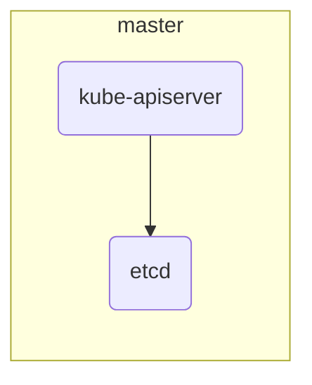
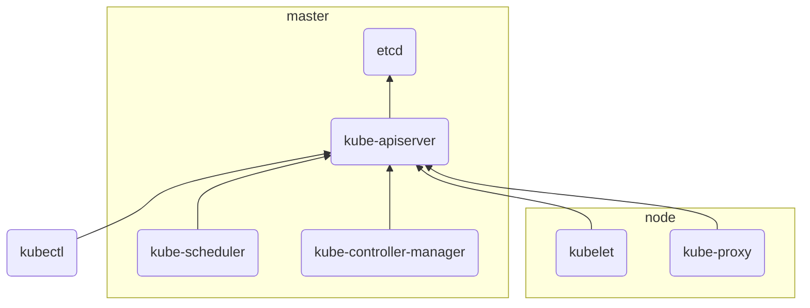
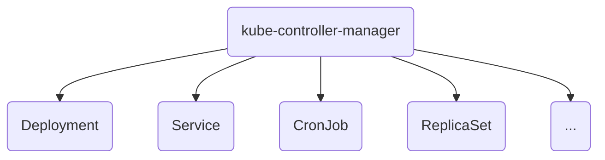
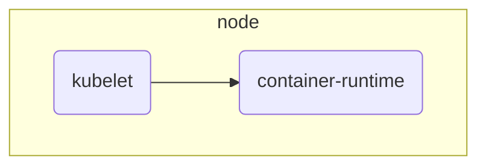

# Kubernetesの構成コンポーネント

[Source](https://qiita.com/tkusumi/items/c2a92cd52bfdb9edd613)

Kubernetesの構成コンポーネントについて一覧をまとめてみました。Kubernetes 1.2時点での情報です。

!!! info "注釈"
    :link:: 外部のプロジェクト

コンポーネント|種別|説明
---|---|---
[etcd](#etcd-link) :link: | master | Kubernetesのリソースの永続化に使われる高信頼分散KVS
[kube-apiserver](#kube-apiserver) | master | Kubernetesのリソースを管理するAPIサーバー
[kube-scheduler](#kube-scheduler) | master | Podのノードへの割り当てを行うスケジューラー
[kube-controller-manager](#kube-controller-manager) | master | Replication Controllerなどの各種コントローラーを起動し管理するマネージャー
[kubelet](#kubelet) | node | Podを起動し管理するエージェント(Nodeのメイン処理)
[kube-proxy](#kube-proxy) | node | KubernetesのServiceが持つ仮想的なIPアドレス(cluster IP)へのアクセスをルーティングする
[container-runtime](#container-runtime) | node | コンテナの実行形態で多くの場合はDockerが使用されている
kubectl | client | KubernetesのCLIクライアント
[hyperkube](#hyperkube-all-in-oneバイナリ) | misc | Kubernetes関連のバイナリを1つにまとめたall-in-oneバイナリ
[pause](#Pauseコンテナ) | misc | pod内のネットワークnamespaceを保持するコンテナ
[pod-master](#pod-master) | add-on | High-Availability構成時にscheduler, controllerがどのMasterで動くかを調整するコンテナ
[kube-dns](#kube-dns) | add-on | クラスタ内DNSのPod
[SkyDNS :link:](#skydns-link) | add-on | クラスタ内DNSのDNSサーバー
[kube2sky](#kube2sky) | add-on | SkyDNSにKubernetesの情報を反映させるブリッジ
[heapster](#heapster) | add-on | Kuernetesのパフォーマンス情報を集約する仕組み

## アーキテクチャ


## Masterコンポーネント

### etcd :link:



etcdはKubernetesのリソースの永続化に使われる高信頼分散KVSです。etcdはKubernetesのリソース以外にも、後述のSkyDNS、pod-masterなどの保存の用途にも使われています(etcdのインスタンスは一般的に別になります)。

etcdのキーはパス形式になっており、API Serverの``--etcd-prefix``オプション(デフォルトは`/registry`)で指定したディレクトリ以下に保存されます。。また``--etcd-servers-overrides``オプションでリソースの種類ごとにetcdのサーバーを変えることも可能です。大規模環境においてはEventsリソースは量が多いため、etcdインスタンスを別にすることが推奨されています。詳細はKubernetesマニュアルの[kube-apiserver](http://kubernetes.io/docs/admin/kube-apiserver/)と[Using Large Clusters](http://kubernetes.io/docs/admin/cluster-large/)の項を参照ください。

etcdはLinuxコンテナ向けdistroのCoreOSを開発する、[CoreOS社](https://coreos.com/)が開発しています。

参考

- https://github.com/coreos/etcd
- [KubernetesのSecretは本当に安全か - Qiita](https://qiita.com/sh-miyoshi/items/a81b5cc6182a62c87a80)
- [Kubernetes Secrets の紹介 – データベースのパスワードやその他秘密情報をどこに保存するか？ – ゆびてく](https://ubiteku.oinker.me/2017/03/01/kubernetes-secrets/)

#### 参考: etcdに保存されているデータのサンプル

Kubernetesリソースのetcdのキーは以下のように保存されています。

```console
# etcdの"/registry"以下のキー名を表示
$ etcdctl ls --recursive /registry
# サンプルを抜粋
/registry/namespaces/default
/registry/namespaces/kube-system
/registry/secrets/default/default-token-qfomx
/registry/secrets/kube-system/default-token-bf0m1
/registry/minions/172.17.4.101
/registry/minions/172.17.4.201
/registry/pods/kube-system/kube-controller-manager-172.17.4.101
/registry/pods/kube-system/heapster-v10-ut5ls
```

valueにはリソースのJSON文字列がそのまま入っています。

```console
$ etcdctl get /registry/ranges/serviceips | jq .
{
  "kind": "RangeAllocation",
  "apiVersion": "v1",
  "metadata": {
    "creationTimestamp": null
  },
  "range": "10.3.0.0/24",
  "data": "IAAACAAAAAAIAAAAAAAAAAAAAAAAAAABAAAAAAADAQ=="
}
```

### kube-apiserver



KubernetesのAPIサーバーで、主にKubernetesのリソース情報の管理を担っています。基本的にリソース情報のCRUD処理のみを行い、リソースに対する実際の処理やスケジューリングは別のコンポーネント(`kube-controller-manager`と`kube-scheduler`)が行います。リソースの状態はすべてetcdに保存されます。APIサーバー以外のコンポーネントは直接etcdを参照せず、APIサーバーを通してリソースにアクセスします。`kubectl`コマンドも、APIサーバーへのアクセスを通して操作を行っています。

認証、認可の他に、Admission Control (参考: [Kubernetes: Admission Controlとは何か](http://qiita.com/tkusumi/items/f71882f47e2d87701223)) というリクエスト制御の仕組みを備えています。

水平スケールさせることが可能なコンポーネントです。

参考

- http://kubernetes.io/docs/admin/kube-apiserver/

### kube-scheduler

新しく作られたPodのノードへの割り当てを行うスケジューラーです。Kubernetes APIを通して、Pod, Nodeなどのリソースをwatchし、[bindings API](http://kubernetes.io/docs/api-reference/v1/operations/#_create_a_binding)でNodeとPodのひも付けを行います。スケジューラのポリシーは設定可能で、`--policy-config-file`という起動オプションで設定のjsonファイルを指定します。(参考: [scheduler-policy-config.json](https://github.com/kubernetes/kubernetes/blob/master/examples/scheduler-policy-config.json))

Podの要求しているリソースやNodeのリソースの使用率などをみて適切なNodeを1つ選択し、PodをNodeに紐付ける(スケジュールする)。

参考

- https://github.com/kubernetes/kubernetes/blob/master/docs/devel/scheduler.md

### kube-controller-manager

Kubernetesの各種リソースのコントローラーを起動するマネージャーです。



各コントローラーはgoroutineで起動されます。(参考: [controllermanager.go#L185-L390](https://github.com/kubernetes/kubernetes/blob/release-1.2/cmd/kube-controller-manager/app/controllermanager.go#L185-L390))。

!!! note

    Replication Controllerはリソース名自体に"Controller"とつくため、コントローラーは"RepplicationManager"という名前になっています。(参考: [replication_controller.go#L63-L64のコメント](https://github.com/kubernetes/kubernetes/blob/b8d000853edbfe3d0d9bcd85e8e511a98b6ac6af/pkg/controller/replication/replication_controller.go#L63-L64))

下記は`kube-controller-manager`をpprofで見た、goroutineで起動する各コントローラーに関する処理の一覧です。

```
k8s.io/kubernetes/pkg/controller/daemon.(*DaemonSetsController).Run
k8s.io/kubernetes/pkg/controller/deployment.(*DeploymentController).Run
k8s.io/kubernetes/pkg/controller/endpoint.(*EndpointController).Run
k8s.io/kubernetes/pkg/controller/gc.(*GCController).Run
k8s.io/kubernetes/pkg/controller/job.(*JobController).Run
k8s.io/kubernetes/pkg/controller/namespace.(*NamespaceController).Run
k8s.io/kubernetes/pkg/controller/node.(*NodeController).Run
k8s.io/kubernetes/pkg/controller/persistentvolume.(*PersistentVolumeClaimBinder).Run
k8s.io/kubernetes/pkg/controller/persistentvolume.(*PersistentVolumeRecycler).Run
k8s.io/kubernetes/pkg/controller/podautoscaler.(*HorizontalController).Run
k8s.io/kubernetes/pkg/controller/replicaset.(*ReplicaSetController).Run
k8s.io/kubernetes/pkg/controller/replication.(*ReplicationManager).Run
k8s.io/kubernetes/pkg/controller/resourcequota.(*ResourceQuotaController).Run
k8s.io/kubernetes/pkg/controller/serviceaccount.(*ServiceAccountsController).Run
k8s.io/kubernetes/pkg/controller/serviceaccount.(*TokensController).Run
```

参考

- http://kubernetes.io/docs/admin/kube-controller-manager/

## Nodeコンポーネント

### kubelet

!!! quote
    kubelet はPodを起動、管理するエージェントだ。

    kube-scheduler によって紐付けられた(スケジュールされた)Podをkubeletが認識して、そのPodを自身のNodeで起動させる。 また、実行しているPodの監視・管理も行う。

    なので、実際にコンテナのワークロードを発行しているのはこの kubelet だ。

kubeletは各ノードで動作するエージェントで、Nodeのメイン処理であるPodの起動・管理を行います。起動するPodの情報は、APIサーバーを監視して自ノードに割り当てられたものを見るのが主ですが、他にも下記の3つの方法が用意されています。この仕組みを使うことでAPIサーバーを含むMasterコンポーネントも、kubelet上で動作させることが可能です。

- **ローカルファイル** ノードの特定のディレクトリ(例えば`/etc/kubernetes/manifests`)を監視し、そこに置かれたマニフェストファイルに書かれたPodを起動します。監視するファイルまたはディレクトリは`--config`オプション、監視間隔は`--file-check-frequency`オプション(デフォルトは20秒)で指定します。
- **HTTPエンドポイント** 特定のURLを監視し、そこに置かれたマニフェストファイルに書かれたPodを起動します。監視するURLは` --manifest-url`オプション、監視間隔は`--http-check-frequency=`オプション(デフォルトは20秒)で指定します。
- **HTTPサーバー** Kubelet自体持つのHTTPサーバーに対して、マニフェストを送信する方法です。

参考

- http://kubernetes.io/docs/admin/kubelet/


### kube-proxy

!!! quote

    kube-proxyはKubernetesのServiceオブジェクトを元にルーティングを行う。

    実体はiptablesのルールを発行し、パケットの制御を行っている。

    この実装は切り替えることができ、以下の中から選択できる。

    - userspace
    - iptables
    - ipvs(experimental)

    デフォルトでiptablesが使われる。

kube-proxyは各ノードで動作する、Serviceが持つ仮想的なCluster IPを転送するためのネットワークProxyです。ロードバランスは現状ではラウンドロビンのみがサポートされます。

iptablesを使う高速な`iptables`モードと、ユーザスペースで処理する`userspace`の2つのモードがあり、起動時の`--proxy-mode`オプションで指定できます。オプションを指定しない場合、使用可能であれば`iptables`がデフォルトで選ばれます。ノードのアノテーション`net.experimental.kubernetes.io/proxy-mode`を使ってノードごとに設定することも可能です。`iptables`モードを使った場合、ラウンドロビンは[stasticモジュール](https://linuxjm.osdn.jp/html/iptables/man8/iptables-extensions.8.html#lbCC)によって行われます。

参考

- http://kubernetes.io/docs/admin/kube-proxy/

### Container Runtime



Cotainer Runtimeはkubeletからの呼び出され、コンテナの実行をする。

KubernetesではこのContainer Runtimeを差し替えることが出来る。 他のContainer Runtimeは以下のようなものがある。

- Docker
- containerd
- cri-o
- gVisor
- Kata Containers

大抵のKubernetesのマネージドサービスではDockerが使用されている。 (実際の所Dockerの中身はcontainerdだ)

## その他のコンポーネント

### hyperkube (all-in-oneバイナリ)

hyperkubeはKubernetes関連のバイナリを1つにまとめた、all-in-oneバイナリです。第一引数にコンポーネントの名前を指定して使います。また、busyboxの様にsymlinkをコンポーネント名にして使うこともできます。

Kubernetesのリリース毎にDockerイメージ(`gcr.io/google_containers/hyperkube-amd64`)も更新されており、Kubernetesのコンポーネントをkubelet上で動かす場合は、hyperkubeのDockerイメージを使用するのが一般的です(e.g. [Masterコンポーネントの定義ファイルmaster.json](https://github.com/kubernetes/kubernetes/blob/master/cluster/images/hyperkube/master.json))。

対応コンポーネントは以下です。括弧内は元のバイナリ名です。

- kubectl (`kubectl`)
- apiserver (`kube-apisever`)
- controller-manager (`kube-controller-manager`)
- scheduler (`kube-scheduler`)
- kubelet (`kubelet`)
- proxy (`kube-proxy`)

```console
$ hyperkube kubectl get nodes
```

参考: https://github.com/kubernetes/kubernetes/blob/master/cmd/hyperkube/main.go

### Pauseコンテナ

PauseコンテナはPod内のネットワークネームスペースの情報を保持する特別なコンテナで、すべてのPodに自動的に付加されます。Kubernetes内部では`PodInfraContainerImage`という定数で特別扱いされており、PauseコンテナだけがPod内でネットワークネームスペースの情報を保持し、他のコンテナはそれを共有する方式を取っています。(参考: [pkg/kubelet/dockertools/manager.go](https://github.com/kubernetes/kubernetes/blob/master/pkg/kubelet/dockertools/manager.go))。これによりPodの他のコンテナがkillされたとしてもネットワークネームスペースの情報を保持しておくことができます。Pauseコンテナ自体は文字通りpauseシステムコールを呼び出すだけで何もしません。(参考: [pause.asm#L47](https://github.com/kubernetes/kubernetes/blob/dae5ac482861382e18b1e7b2943b1b7f333c6a2a/third_party/pause/pause.asm#L47))。Pauseコンテナはkubeletの`--pod-infra-container-image`というオプションでイメージを変更することもできます。

参考

- https://github.com/kubernetes/kubernetes/tree/master/third_party/pause
- [Containers at Google > What is the role of 'pause' container?](https://groups.google.com/forum/#!topic/google-containers/jVjv0QK4b_o)

## Add-onコンポーネント

### pod-master

pod-masterはHigh-Availability構成時に`kube-scheduler`, `kube-controller-manager`がどのMasterで動くかを調整するコンテナです。etcdを使ってロックをするシンプルな仕組みで、200行程度のgoのプログラムです(参考[podmaster.go](https://github.com/kubernetes/contrib/blob/master/pod-master/podmaster.go))。ロックを取得したMasterサーバーがローカルのマニフェストファイルを反映させるというやり方で、どのMasterで`kube-scheduler`、`kube-controller-manager`を動かすか調整しています。kubernetesレポジトリの`docs/admin/high-availability`の [podmaster.yaml](https://github.com/kubernetes/kubernetes/blob/master/docs/admin/high-availability/podmaster.yaml)の設定例が参考になります。

`kube-scheduler`, `kube-controller-manager`自体にもリーダー選出の機能(`--leader-elect`オプション)が実装されているようなので、今後は不要になるコンポーネントかもしれません。(参考 [pkg/client/leaderelection](https://github.com/kubernetes/kubernetes/tree/master/pkg/client/leaderelection))

参考

- https://github.com/kubernetes/contrib/tree/master/pod-master
- http://kubernetes.io/docs/admin/high-availability/
- Issue: [leaderelection: retrofit controller-manager with leaderelection client #19621](https://github.com/kubernetes/kubernetes/pull/19621)
- Issue: [retrofit the scheduler with the leader election client. #19347](https://github.com/kubernetes/kubernetes/pull/19347)

### kube-dns

`kube-dns`はクラスタ内DNSのPodの名前です。Serviceリソースが作られた時、kube-dnsに登録され、クラスタ内部から名前解決できるようになります。デフォルトでは`cluster.local`というドメインが使われます。Serviceは`{Service名}.{ネームスペース}.svc.cluster.local`という形式のFQDNでAレコード、SRVレコードに登録されます。

kube-dnsのPodは以下の4コンテナで構成されています。

- **skydns** DNSサーバー
- **etcd** skydnsのデータを保存する専用etcd
- **kube2sky** SkyDNSにKubernetesの情報を反映させるブリッジ
- **healthz** 定期的にnslookupしてヘルスチェックを行う

参考

- https://github.com/kubernetes/kubernetes/tree/master/cluster/addons/dns
- http://kubernetes.io/docs/admin/dns/

### SkyDNS :link:

クラスタ内のDNSとして使われているDNSサーバーです(kube-dnsの一部)。データの永続化にはetcdが用いられます。

参考

- https://github.com/skynetservices/skydns


### kube2sky

SkyDNSにKubernetesの情報を反映させるブリッジです。KubernetesのAPIでService, Endpoints, Podをwatchし、SkyDNSのetcdに書き込むことでDNSの情報を反映させます。

参考

- https://github.com/kubernetes/kubernetes/tree/master/cluster/addons/dns/kube2sky


### heapster

heapsterはクラスタ全体の使用状況を集約するためのコンポーネントです。ストレージはプラガブルな仕組みになっており、InfluxDB, Google Cloud Monitoring, Kafkaなど複数のストレージをサポートします。

- https://github.com/kubernetes/heapster
- http://blog.kubernetes.io/2015/05/resource-usage-monitoring-kubernetes.html
